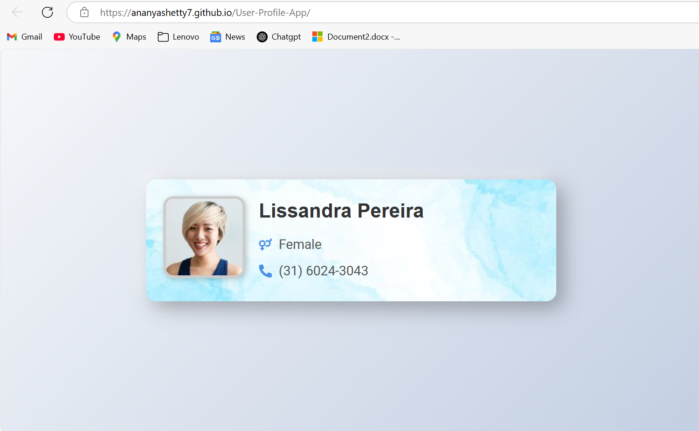
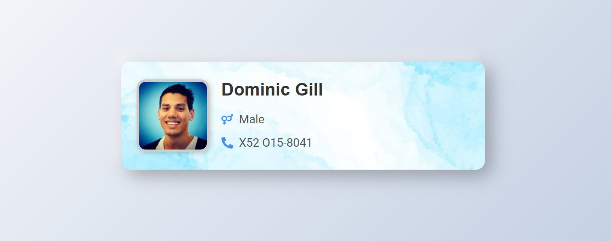

# 🌟 User Profile App

Welcome to the **User Profile App** – a React application that dynamically fetches user data and displays it in a sleek and responsive card layout. Built with **React (Vite), Node.js, Tailwind CSS, JavaScript, and the RandomUser API**, this project showcases a seamless combination of modern frontend technologies and API integration.

## 📸 Live Demo  
🔗 **Live Site:** [User Profile App](https://Ananyashetty7.github.io/User-Profile-App)

---

## 📌 Features

✅ **Dynamic User Data** – Fetches random user profiles from [RandomUser API](https://randomuser.me/)  
✅ **Modern UI** – Styled using **Tailwind CSS** for a clean, responsive, and professional look  
✅ **API Integration** – Fetches real-time user details like **name, gender, phone number, and profile picture**  
✅ **Optimized Performance** – Uses **Vite** for lightning-fast builds and hot module reloading  
✅ **Fully Responsive** – Works perfectly on desktops, tablets, and mobile devices  
✅ **Hosted on GitHub Pages** – Easily accessible via a live URL  

---

## 🛠 Technologies Used

- **React (Vite)** – Fast and modern frontend framework ⚛️  
- **Node.js** – JavaScript runtime for server-side functionality 🟢  
- **Tailwind CSS** – Utility-first CSS framework for rapid UI development 🎨  
- **JavaScript (ES6+)** – Clean and modular scripting for smooth user experience 💡  
- **RandomUser API** – Fetches dynamic user data 🌐  
- **GitHub Pages** – Live hosting for easy access 🚀  

---

## 📂 Project Structure

```
User-Profile-App/
├── public/              # Static assets (e.g., images)
├── src/                 # Main source code
│   ├── components/      # React components
│   ├── App.jsx          # Main App component
│   ├── index.css        # Global styles
│   ├── main.jsx         # Entry point
├── package.json         # Dependencies & scripts
├── vite.config.js       # Vite configuration
├── tailwind.config.js   # Tailwind configuration
├── README.md            # Project documentation (this file)
├── screenshots/         # Folder containing project screenshots
```

---

## 📸 Screenshots  

### **Full-Screen View**  


### **User Profile Card**  


---

## **Author**
- **Ananya G Shetty**
---

### 🎉 **Thank you for visiting! I hope you find this project useful and inspiring! 🚀**
